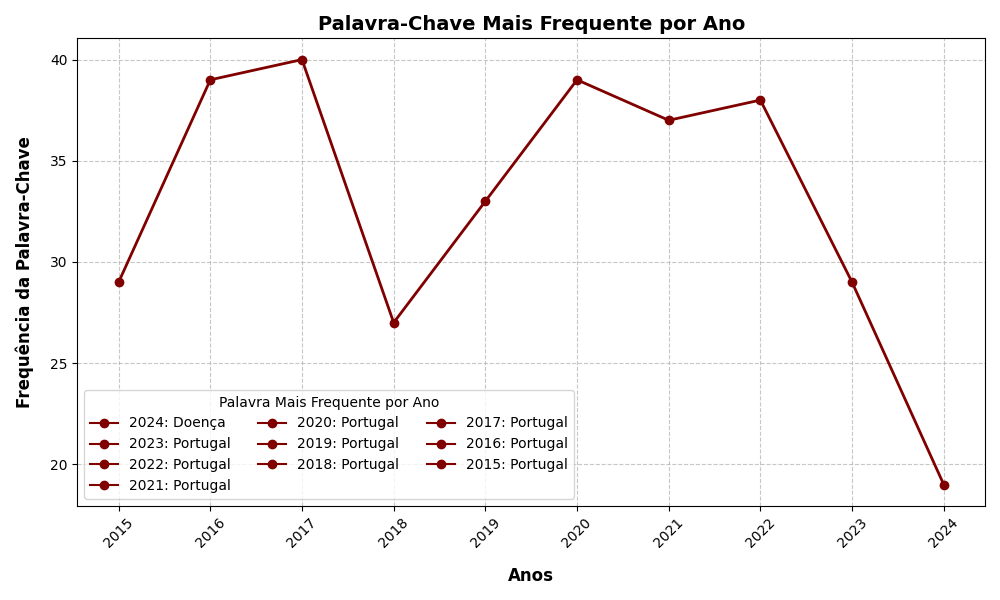

RELATÓRIO DE ESTATÍSTICAS

Palavra-chave mais frequente por ano:
- 2024: Doença (19 ocorrências)
- 2023: Portugal (29 ocorrências)
- 2022: Portugal (38 ocorrências)
- 2021: Portugal (37 ocorrências)
- 2020: Portugal (39 ocorrências)
- 2019: Portugal (33 ocorrências)
- 2018: Portugal (27 ocorrências)
- 2016: Portugal (39 ocorrências)
- 2017: Portugal (40 ocorrências)
- 2015: Portugal (29 ocorrências)

Gráfico de Palavra-Chave Mais Frequente por Ano

